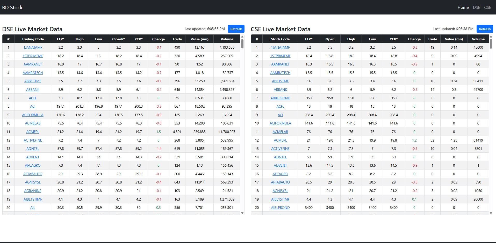
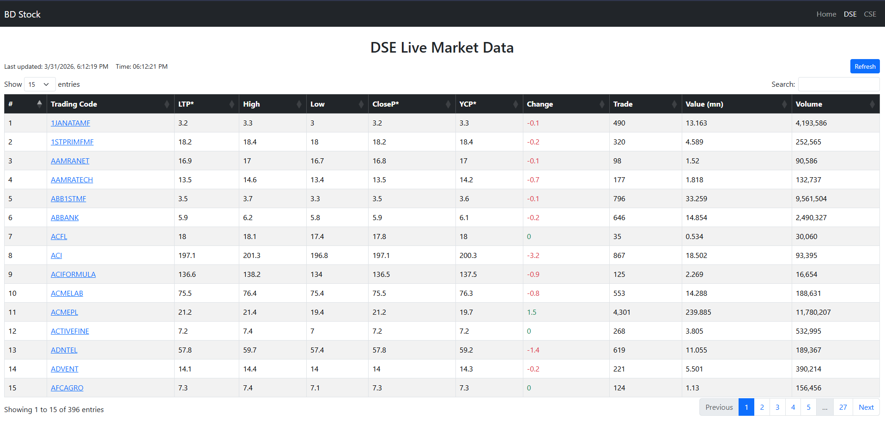
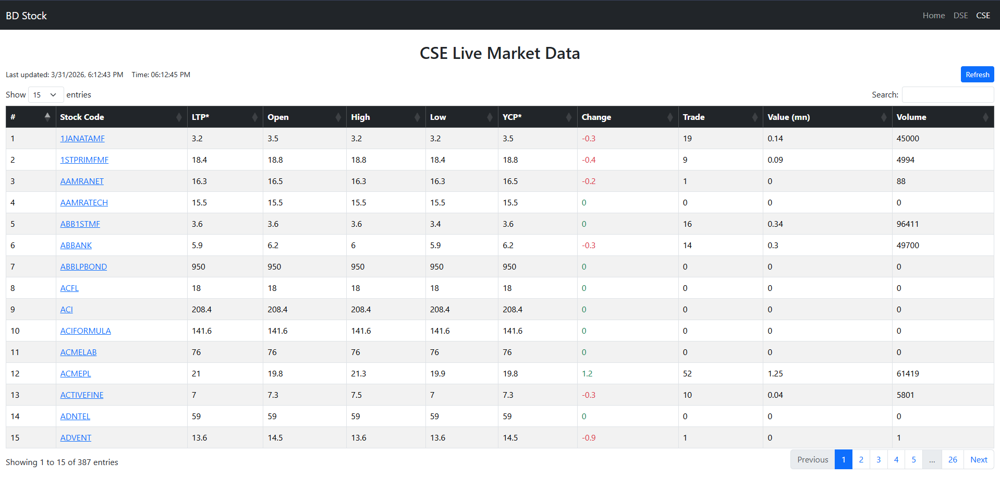

# Bangladesh Stock Market Dashboard

**Author:** Kejubayer  

A real-time stock market dashboard for **DSE** (Dhaka Stock Exchange) and **CSE** (Chittagong Stock Exchange) built with **Laravel**. It fetches and displays live market data with automatic updates every minute. The dashboard features responsive tables, live clocks, and a refresh button for easy monitoring.

---

## Features

- Real-time market data for **DSE** and **CSE**.
- Simple and responsive tables (no heavy DataTables dependency).
- Automatic refresh every **1 minute**.
- Manual refresh button for instant updates.
- Mobile-friendly and responsive design.
- Easy to extend with additional market data or features.

---

## Screenshots

  
  
  

---

## Installation

1. Clone the repository:
    ```bash
    git clone https://github.com/kejubayer/bangladesh-stock-market-dashboard.git
    ```
2. Navigate to project:
    ```bash
    cd bangladesh-stock-market-dashboard
    ```
3. Install dependencies:
    ```bash
    composer install
    npm install && npm run dev
    ```
4. Configure environment:
    ```bash
    cp .env.example .env
    php artisan key:generate
    ```
5. Serve the application:
    ```bash
    php artisan serve
    ```

---

## Routes

- **Home Page:** `/` – Displays both DSE and CSE live market tables.
- **DSE Data API:** `/dse-data` – Fetches DSE stock data.
- **CSE Data API:** `/cse-data` – Fetches CSE stock data.

---

## Technologies Used

- **Backend:** Laravel 10, PHP 8+
- **Frontend:** Bootstrap 5, jQuery
- **Data Fetching:** HTTP scraping using Laravel HTTP client
- **Caching:** Laravel Cache (5 minutes)

---

## Author

**Kejubayer** – [GitHub Profile](https://github.com/kejubayer)

---

## License

This project is open-source and available under the [MIT License](LICENSE).

---

**SEO Keywords:** DSE Live Market, CSE Live Market, Bangladesh Stock Dashboard, Real-time Stock Market Bangladesh, Laravel Stock Market Project
